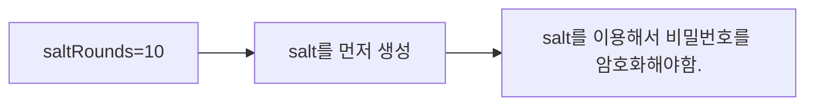

# 회원 가입 기능 만들기

회원 가입 기능 만들기 전 설정해야할 것과 다운 받아야할 Dependency들

## Client - Server 통신하는 법

Client -> Server
: Request with Body the JSON, buffer, string and URL encode data

- Body 데이터를 분석(parse)해서 req.body로 출력해주는 것
- Body-parser Dependency
- npm install body-parser --save

## Client에서 Request를 줘야하는데 현재 Client가 없으니 POSTMAN을 이용해서 Request를 보낸다.

1. POSTMAN 다운로드 [링크](https://www.postman.com/downloads/)
2. Register Route 만들기

### Postman 시작하기

http://localhost:3000/register

- POST 방식 - raw - JSON으로

```json
{
  "name": "jihyeon123",
  "email": "jihyeon123@gmail.com",
  "password": "1234567"
}
```

```json
{
  "success": true
}
```

> 회원가입이 성공한 것을 확인할 수 있다. (user.js에 의해서)

---

# 8 Nodemon 설치하기

1. Node mon? 소스를 변경할 때 그걸 감지해서 자동으로 서버를 재시작해주는 툴
   > 변경된 내용을 계속 Refresh 해줘도 바뀌지 않아 서버를 껐다 켜야하는 문제가 발생한다. 그 사항이 맞지 않기에, 그때문에 Nodemon이 아주 좋다.
2. Nodemon 다운로드

```shell
npm install nodemon --save-dev
```

> dev를 붙이는 이유는 development 모드라서 로컬에서만 쓴다고 적어주는 것이 적절하다!

---

# 9. 비밀 설정 정보 관리

1. 소스 코드를 Git에다가 올리면 다른 사람들이 Secret한 정보들을 다 보게됨.
2. 그래서 비밀 정보들을 다 한 파일에다 몰아둔 후 .gitignore 파일에 넣어둔다.
3. 개발환경이 로컬인지 아니면 배포 모드에서 인지에 따라서도 다르게 해줘야 한다.4. 에를 들어 heroku 서비스를 통해 배포할 때

## 환경 변수 process.env.NODE_ENV

1. Local 환경에서 -> development
2. Deploy(배포)한 후 -> production

---

# Bcrypt로 비밀번호를 암호화하기

> mongodb 에서 Collections에 들어가보면 확인할 수 있다!!

1. 현재 데이터 베이스에 저장된 비밀번호를 보면 너무 안전하지 않음.
2. 그래서 Bcrypt를 이용하여 비밀번호를 암호화해줘서 데이터베이스에 저장해줘야함.

```
npm install bcrypt --save
https;//www.npmjs.com/package/bcrypt
```

## Bcrypt로 비밀번호 암호화 하는 순서

1. 먼저 Register Route로 가기
   [Bcrypt 사이트](https://www.npmjs.com/package/bcrypt) - 여기서 Technique 1

2. 유저 정보들 (Account, Password 등등)을 데이터 베이스에 저장하기 전이 암호화할 타이밍

- Salt를 이용해서 비밀번호를 암호화해야 함.

3. Bcrypt 사이트 보면서 진행

- bcrypt 사이트 보면서 진행

4. salt 생성
   > sale - [Required] - the salt to be used to hash the password. if specified as a number then a salt will be generated with the specified number of rounds and usd( see example under **Usage**).



---

# 11. 로그인 기능 with Bcrypt

1. login route 만들기
2. 데이터 베이스에서 요청한 이메일 찾기(User.findOne())
3. 데이터 베이스에서 요청한 이메일이 있다면 비밀번호가 같은지 확인
   (Bcrypt를 이용하여 plain password와 암호화된(Hashed) 패스워드가 같은지 확인)
4. 비밀번호까지 같다면 Token을 생성
   (토큰 생성을 위해서 JSONWEBTOKEN 라이브러리를 다운로드)

```shell
npm install jsonwebtoekn --save
```

- 사이트 참조하여 토큰 생성 [사이트](https://npmjs.com/package/jsonwebtoken)

### Synchronous Sign with default(HMAC SHA256)

```js
var jwt = require("jsonwebtoken");
var token = jwt.sign({ foo: "bar" }, "shhhhh");
```

> 비밀번호까지 맞다면 토큰을 생성하게 되는데, 토큰은 주로 쿠키나 로컬 스토리지에 저장하게 된다. (이는 개발자 도구에서 Application에서 확인할 수가 있다. 여기서는 쿠키에 하기로 하였음.)`

### Cookie parser 다운로드

```shell
npm install cookie-parser --save
```

---

# Auth 기능 만들기

1. auth route 만들기

- 페이지 이동 때마다 로그인 되있는지 안되어 있는지, 관리자 유저인지등을 체크
- 글을 쓸때나 지울때 같은데 권한이 있는지 같은 것도 체크

2. HOW?
   Server Client

DB(Token)<------- Cookie(Token) : 같으면 인증이 맞다!
USER ID <---(Decode Token with JWT)---Token

### 원리

1. Cookie에 저장된 Token을 Server에 가져와서 복호화를 한다.
2. 복호화를 하면 User ID가 나오은데 그 USER ID를 이용해서 데이터베이스 User Collection에서 유저를 찾은 후 쿠키에서 받아온 Token이 유저도 갖고 있는지 확인
   ---(쿠키가 일치 X)---> Authentication False!
   (쿠키가 일치!)

---

# 로그아웃 기능 만들기

1. 로그아웃 Route 만들기
2. 로그아웃 하려는 유저를 데이터베이스에서 찾아서 그 유저의 토큰을 지워준다.
