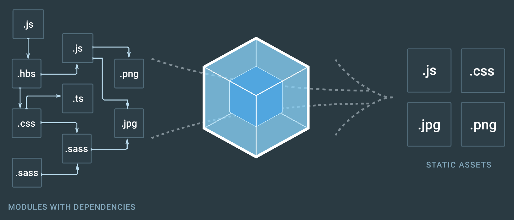

# What is REACT JS?

## React JS ?

1. Libray, Made by Facebook
2. Components : module과 비슷하게 컴포넌트로 이뤄져 있어서 reusable이 뛰어남.
3. Virtual DOM

## Real DOM Vs Virtual DOM

### Real DOM

> 만약 10개의 리스트가 있다면 그 중에 하나의 리스트만 Update됨. 전체리스트를 다시 Reload 해야됨. Super Expensive한 작업

### Virtual DOM

> 만약 10개의 리스트가 있다면 그 중에 하나의 리스트만 Update 됨. 그 바뀐 한가지 아이템만 DOM에서 바꿔준다. HOW?

1. Virtual DOM은 Real DOM과 같은 properties들을 갖고 있으면 그냥 가볍게 Real DOM을 Copy한라 보면 된다!
2. JSX을 렌더링 한다. 그러면 Virtual DOM이 Update가 됨
3. Virtual DOM이 이전 Virtual DOM에서 찍어둔 Snapshot과 비교를 해서 바뀐 부분을 찾는다.
4. Virtual DOM이 이전 virtual DOM에서 찍어둔 Snapshot과 비교를 해서 바뀐 부분을 찾는다. 이 과정을 "diffing"이라고 함.

---

# 16. Create-React-App

1. 원래 리액트 앱을 처음 실행하기 위해서 webpack이나 babel 같은 것을 설정하기 위해서 엄청나게 많은 시간이 걸렸다.

- 하지만 이제는 create-react-app Command로 바로 시작할 수 있다.

```shell
npx create-react-app

//npm install -g create-react-app
```

> 원래는 npm 활용했지만 이제는 npx를 이용하여 다운 받지 않고 사용가능하다!

2. Babel
   : 최신 자바스크립트 문법을 지원하지 않는 브라우저들을 위해서 최신 자바스크립트 문법을 구형 브라우저에서도 돌수있게 변환 시켜줌.

3. WebPack
   : At its core, webpack is a static module bundler for modern JavaScript applications. When webpack processes your application, it internally builds a dependency graph which maps every module your project needs and generates one or more bundles.


-> 다양한 언어와 라이브러리 모듈을 간단하게 만들 수 있다.

---

# 17. NPM NPX

## What is NPM

- 레지스트리를 담고 있고, 빌드를 시켜줌!
- -g 를 하지 않으면 로컬에 다운로드 받게 된다!
- npm install -g -> 컴퓨터 안에 &AppData%/npm에 다운받아짐(윈도우)

> It is an online repository for the publishing of open-source Node.js projects

> It is a command-line utility for interacting with the said repository that aids in package installation, version management, and depedency management.

## 결론

> 만약 설치하는 NPM을 다른 프로젝트에서 쓰지 않는다면 Global로 설치할 필요가 없음. 그러므로 Disk Space를 낭비하지 않을 수 있다.

> npx가 npm registry에서 create-react-app을 찾아서 다운로드없이 실행 가능

- Disk Space를 낭비하지 않을 수 있음.
- 항상 최신 버전을 사용할 수 있음.

---

# 18. Create React APP 구조 설명

- public - index.html

```html
<div id="root"></div>
```

- index.js

```js
ReactDOM.render(
  <React.StrictMode>
    <App />
  </React.StrictMode>,
  document.getElementById("root")
); //index.html 가보면 id = 'root'를 불러옴.
```

> 위 사항등을 기반으로 해서 root에 해당하는 부분을 렌더링해서 보여주게 되는 구조이다!

### webpack

- 퍼블릭에서는 웹펙이 관리해주지 않는다.
- 이미지는 src에 넣도록 하자!

---

# 19. CRA to OUR BoilerPlate

# 구조

my-app/
README.md
node_modules/
package.json
pubic/  
 index.html
favicon.ico
-> public/index.html에서만 쓰임
src/
App.css
App.js
App.test.js
index.css
index.js
logo.svg
-> JS와 CSS 넣으면 됨. Webpack은 여기만 봄.

### 구성 요소

src
\_actions
\_reducers
components
views
Footer
LandingPage
Sections
LandingPage.js
LoginPage
NavBar
RegisterPage
App.js
Coding.js
hoc
utils
index.css
index.js
serviceWorker.js
setupProxy.js

\_actions, \_reducer -> Redux를 위한 폴더들
components/views -> 이 안에는 Page들을 넣는다.
components/views/Sections -> 이 안에는 해당 페이지에 관련된 css 파일이나, component 들을 넣는다.
App.js -> Routing 관련 일을 처리한다.
Config.js -> 환경 변수 같은 것들을 정하는 곳
hoc -> Higher Order Component의 약자
utils -> 여러 군데에서 쓰일 수있는 것들을 넣어둬서 어디서든 쓸 수 있게 함.

### HOC

Auth(HOC) 안에 ADMIN COMPONENT(Admin 유저만 들어올 수 있는 곳)

> 여기서 해당 유저가 해당 페이지에 들어갈 자격이 되는지를 알아낸 후 w 자격이 된다면 ADMIN component에 가게 해주고 아니라면 다른 페이지로 보내버린다.

### Extension

ES7 React/Redux/GraphQL/React-Native snippet
다운로드 받기!

---

# 20.React Router DOM

1. 페이지 이동을 할 때, React Router Dom이라는 것을 사용한다.
2. 어떻게 사용하는지 웹사이트 참조 (https://reacttraining.com/react-router/web/example/basic)
3. Dependency 다운로드! (npm install react-router-dom --save)
4. react router dom 코드 Documentation에서 복사해서 붙여넣기
5. 그 후 우리 앱에 맞게 바꿔서 넣기
6. Page 2개 정도 만들어서 잘되느지 테스트!!

---

# 21. 데이터 Flow & Axios

## Data Request, Respone Flow 그리고 Axios

Server <---(REQUEST)---Client
----(RESPONSE)-->
|
|
DATABASE

> 요청을 할때 지금까지는 Client 부분이 없었기에 POSTMAN을 이용해서 함!

> 하지만 이제는 있으니까 REACT JS 부분에서 REQUEST를 보내면 되는데 그떄 사용할게 AXIOS jQuery를 사용할떄 AJAX라고 보면됨.

> npm install axios--save

> 서버는 5000으로 설정하고, 클라이언트는 3000으로 설정하고 보도록 한다!!!

---

# 22. CORS 이슈, PROXY 설정

- 두개의 다른 포트를 가지고 있는 서버는 아무설정없이 요청을 보낼 수가 없다.!!!

> CORS 정책! (Cross-Origin Resource Sharing(CORS)보안을 위해서)


> 우리는 많은 해결 방법 중에서 Proxy를 통해서 해결하기로 하였다!

[proxy in react](https://create-react-app.dev/docs/proxying-api-requests-in-development)
