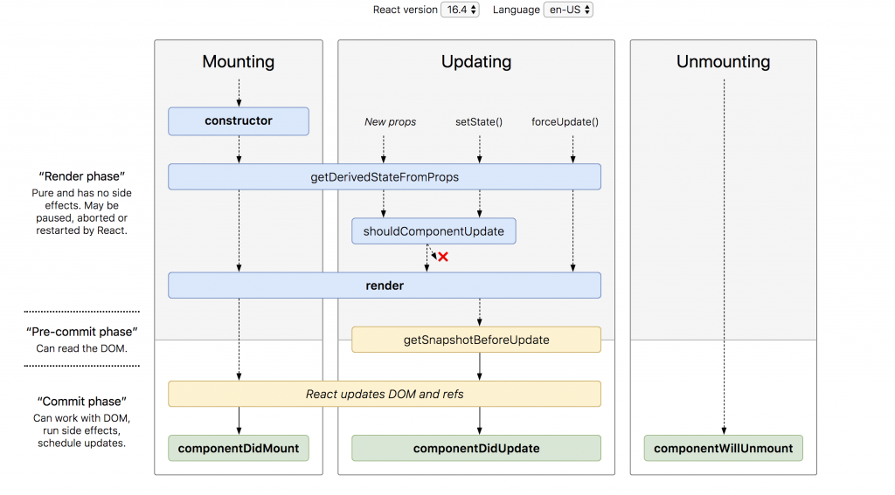

# What is REACT JS?

## React JS ?

1. Libray, Made by Facebook
2. Components : module과 비슷하게 컴포넌트로 이뤄져 있어서 reusable이 뛰어남.
3. Virtual DOM

## Real DOM Vs Virtual DOM

### Real DOM

> 만약 10개의 리스트가 있다면 그 중에 하나의 리스트만 Update됨. 전체리스트를 다시 Reload 해야됨. Super Expensive한 작업

### Virtual DOM

> 만약 10개의 리스트가 있다면 그 중에 하나의 리스트만 Update 됨. 그 바뀐 한가지 아이템만 DOM에서 바꿔준다. HOW?

1. Virtual DOM은 Real DOM과 같은 properties들을 갖고 있으면 그냥 가볍게 Real DOM을 Copy한라 보면 된다!
2. JSX을 렌더링 한다. 그러면 Virtual DOM이 Update가 됨
3. Virtual DOM이 이전 Virtual DOM에서 찍어둔 Snapshot과 비교를 해서 바뀐 부분을 찾는다.
4. Virtual DOM이 이전 virtual DOM에서 찍어둔 Snapshot과 비교를 해서 바뀐 부분을 찾는다. 이 과정을 "diffing"이라고 함.

---

# 16. Create-React-App

1. 원래 리액트 앱을 처음 실행하기 위해서 webpack이나 babel 같은 것을 설정하기 위해서 엄청나게 많은 시간이 걸렸다.

- 하지만 이제는 create-react-app Command로 바로 시작할 수 있다.

```shell
npx create-react-app

//npm install -g create-react-app
```

> 원래는 npm 활용했지만 이제는 npx를 이용하여 다운 받지 않고 사용가능하다!

2. Babel
   : 최신 자바스크립트 문법을 지원하지 않는 브라우저들을 위해서 최신 자바스크립트 문법을 구형 브라우저에서도 돌수있게 변환 시켜줌.

3. WebPack
   : At its core, webpack is a static module bundler for modern JavaScript applications. When webpack processes your application, it internally builds a dependency graph which maps every module your project needs and generates one or more bundles.


-> 다양한 언어와 라이브러리 모듈을 간단하게 만들 수 있다.

---

# 17. NPM NPX

## What is NPM

- 레지스트리를 담고 있고, 빌드를 시켜줌!
- -g 를 하지 않으면 로컬에 다운로드 받게 된다!
- npm install -g -> 컴퓨터 안에 &AppData%/npm에 다운받아짐(윈도우)

> It is an online repository for the publishing of open-source Node.js projects

> It is a command-line utility for interacting with the said repository that aids in package installation, version management, and depedency management.

## 결론

> 만약 설치하는 NPM을 다른 프로젝트에서 쓰지 않는다면 Global로 설치할 필요가 없음. 그러므로 Disk Space를 낭비하지 않을 수 있다.

> npx가 npm registry에서 create-react-app을 찾아서 다운로드없이 실행 가능

- Disk Space를 낭비하지 않을 수 있음.
- 항상 최신 버전을 사용할 수 있음.

---

# 18. Create React APP 구조 설명

- public - index.html

```html
<div id="root"></div>
```

- index.js

```js
ReactDOM.render(
  <React.StrictMode>
    <App />
  </React.StrictMode>,
  document.getElementById("root")
); //index.html 가보면 id = 'root'를 불러옴.
```

> 위 사항등을 기반으로 해서 root에 해당하는 부분을 렌더링해서 보여주게 되는 구조이다!

### webpack

- 퍼블릭에서는 웹펙이 관리해주지 않는다.
- 이미지는 src에 넣도록 하자!

---

# 19. CRA to OUR BoilerPlate

# 구조

my-app/
README.md
node_modules/
package.json
pubic/  
 index.html
favicon.ico
-> public/index.html에서만 쓰임
src/
App.css
App.js
App.test.js
index.css
index.js
logo.svg
-> JS와 CSS 넣으면 됨. Webpack은 여기만 봄.

### 구성 요소

src
\_actions
\_reducers
components
views
Footer
LandingPage
Sections
LandingPage.js
LoginPage
NavBar
RegisterPage
App.js
Coding.js
hoc
utils
index.css
index.js
serviceWorker.js
setupProxy.js

\_actions, \_reducer -> Redux를 위한 폴더들
components/views -> 이 안에는 Page들을 넣는다.
components/views/Sections -> 이 안에는 해당 페이지에 관련된 css 파일이나, component 들을 넣는다.
App.js -> Routing 관련 일을 처리한다.
Config.js -> 환경 변수 같은 것들을 정하는 곳
hoc -> Higher Order Component의 약자
utils -> 여러 군데에서 쓰일 수있는 것들을 넣어둬서 어디서든 쓸 수 있게 함.

### HOC

Auth(HOC) 안에 ADMIN COMPONENT(Admin 유저만 들어올 수 있는 곳)

> 여기서 해당 유저가 해당 페이지에 들어갈 자격이 되는지를 알아낸 후 w 자격이 된다면 ADMIN component에 가게 해주고 아니라면 다른 페이지로 보내버린다.

### Extension

ES7 React/Redux/GraphQL/React-Native snippet
다운로드 받기!

---

# 20.React Router DOM

1. 페이지 이동을 할 때, React Router Dom이라는 것을 사용한다.
2. 어떻게 사용하는지 웹사이트 참조 (https://reacttraining.com/react-router/web/example/basic)
3. Dependency 다운로드! (npm install react-router-dom --save)
4. react router dom 코드 Documentation에서 복사해서 붙여넣기
5. 그 후 우리 앱에 맞게 바꿔서 넣기
6. Page 2개 정도 만들어서 잘되느지 테스트!!

---

# 21. 데이터 Flow & Axios

## Data Request, Respone Flow 그리고 Axios

Server <---(REQUEST)---Client
----(RESPONSE)-->
|
|
DATABASE

> 요청을 할때 지금까지는 Client 부분이 없었기에 POSTMAN을 이용해서 함!

> 하지만 이제는 있으니까 REACT JS 부분에서 REQUEST를 보내면 되는데 그떄 사용할게 AXIOS jQuery를 사용할떄 AJAX라고 보면됨.

> npm install axios--save

> 서버는 5000으로 설정하고, 클라이언트는 3000으로 설정하고 보도록 한다!!!

---

# 22. CORS 이슈, PROXY 설정

- 두개의 다른 포트를 가지고 있는 서버는 아무설정없이 요청을 보낼 수가 없다.!!!

> CORS 정책! (Cross-Origin Resource Sharing(CORS)보안을 위해서)


> 우리는 많은 해결 방법 중에서 Proxy를 통해서 해결하기로 하였다!

[proxy in react](https://create-react-app.dev/docs/proxying-api-requests-in-development)

---

# 23. Proxy Server?

서버는 5000번 포트, 클라이언트는 3000번 포트로 요청, 응답작업을 수행하게 된다.

이때 유저가 111.111.111.111의 아이피를 갖고 있다고 할때,

> 프록시 서버는 1. 아이피를 Proxy Server에서 임의로 바꿔 버릴수 있다. 그래서 인터넷에서는 접근하는 사람의 IP를 모르게 된다. 2. 보내는 데이터도 임의로 바꿀 수 있다.
> 그렇다면 인터넷에서는 어떤 작업을 수행하고 요청, 응답을 하게 될까?

### 프록시 서버의 기능

1. 방화벽 기능
2. 웹 필터 기능
3. 캐쉬 데이터, 공유 데이터 제공 기능

### 프록시 서버 사용하는 이유

1. 회사에서 직원이나 집안에서 아이들 인터넷 사용 제어
2. 캐시를 이용해서 더 빠른 인터넷 이용 제공
3. 더 나은 보안 제공
4. 이용 제한된 사이트 접근 가능!

---

# 23. Concurrently

## Concurrently를 이용해서 프론트, 백 서버 한번에 켜기

What is concurently?
-> 여러개의 commands를 동시에 작동시킬 수 있게 해주는 툴

> 서버와 클라이언트를 한번에 킬수 있음

```
npm install concurrently --save
```

## 사용법

### Usage

Remember to surround seperate commands with quotes

```
concurrently "command1 arg" "command2 arg"
```

otherwise concurrently would try to run 4 separate commands: command1, arg, command2, arg

In package.json, escape quotes:

```
"start": "concurrently \ "command1 arg \" \"command2 arg\""
```

```
"dev": "concurrently \"npm run backend\" \"npm run start --prefix client\"",
```

> 아주 좋다...ㅎㅎ

---

# 25. Antd CSS Framework

## CSS Framework를 쓰는 이유?

- 기능을 만드는데 더욱 집중하기 위해서

## CSS Framework 종류 For react js

1. material UI
2. React Bootstrap
3. Semantic UI
4. Ant Design
5. Materialize
   ...

[ant design](https://ant.design)

```
npm install antd --save
```

---

# Redux 설명

1. What is Redux?
   : Redux is a predictable state container for JavaScript apps. (상태 관리 라이브러리)

2. So What is State?

## React 에서는..

1. Props

- shorthand for properties
- Props are how components talk to each other.
- props flow downwards from the parent component
- Props are immutable from the child perspective if you want to change that value? the parent should just change its internal state.

```js
<ChatMessages message={message} currentMember={member} />
```

2. State

- parent component에서 child component로 data를 보내는 게 아닌 그 component 안에서 데이터를 전달하려면? state로?
- state is mutable
- state가 변하면 re-render가 된다.

```js
state = {
  message:",
  attachFile:undefined,
  openMenu:false,
};
```

> Redux는 state를 관리하는 툴


### Action

: a plain object describing what happened

```js
{type: 'LIKE_ARTICLE', articleID:42}
{type: 'FETCH_USER_SUCCESS', response:{id:3, name:'Mary'}}
{type:'ADD_TODO',text:'Read the Redux docs.'}
```

### Reducer

: a function describing how the application's state changes

```js
(previousStaete, action) => nextState;
```

-> 이전 State와 action Object를 받은 후에 next state를 리턴한다.

- Reducer는 pure function이기에, reducer 내부에서 하지 말아야 할 것들!
  - Mutate its arguments,
  - Perform side effects like API calls and routing transitions;
  - Call non-pure functions, e.g. Date.now() or Math.random().

### Store (스테이트 감싸주기!)

: the object that brings them together. A store holds the whole state tree of your application. The only way to change the state inside it is to dispatch an action on it. A store is not a class. It's jus an object with a few methods on it.

<Provider /> is the higher-order component provided by React Redux that lets you bind Redux to React

---

# 27 REDUX UP

# Setting up Redux

```
npm install redux react-redux redux-promise redux-thunk --save
```

1. 다운받아야할 Dependency들

- redux
- react-redux
  (아래는 redux 미들 웨어)
- redux-promise
- redux-thunk

2. Redux 기본 구조(scaffolding)만들기

### What does Redux-promise, Redux-thunk do?

- They are Middleware! But what they really do as middleware?
- A basic Redux store will only accept dispathing plain object actions
- But it doesn't always get plain object

- So a middleware can "teach" dispatch(). how to accept something that's not a plain action object, by intercepting the value and doing something else instead.

- **Redux-thunk** teaches dispatch how to accept functions, by intercepting the function and calling it instead of passing it on the reducers.

- **Redux-promise** teaches dispatch how to accept promise, by intercepting the promise and dispatching action when the promise resolves or rejects

Just Simply Put,
Redux-thunk and Redux-promise help us to use Redux Well!

## Combined Reducer

- User/Post/Number/Comment/Subscribe Reducer 등을 CombineReducer를 통해서 RootReducer에서 하나로 합치게 된다!!

---

# 28. React Vs React Hooks

React Components

| React                 | React Hooks           |
| --------------------- | --------------------- |
| Class Component       | Function Component    |
| Provide more features | Provide less features |
| Longer Code           | Shorter Code          |
| More Complex Code     | Simpler Code          |
| Slower Performance    | Faster Performance    |

#### React

```js
import React, { Component } from "react";

export default class Hello extends Components {
  render() {
    return <div>hello my friends!</div>;
  }
}
```

#### React Hook

```js
import React from 'react'

export default function Hello() {
  render(){
    return (
      <div>
        hello my friends!
      </div>
    )
  }
}
```



- 생성되고, 업데이트 되고, 없애고,
  > functional 에서는 위 기능을 못 쓰게 되어 비효율을 낳았는데, Hook이 생기면서 위 기능들을 활용할 수 있게 되었다!!!

```js
import React, { Component } from "react";
import Axios from "axios";

export default class Hello extends Components {
  constructor(props) {
    super(props);
    this.state = { name: "" };
  }

  componentDidMount() {
    Axios.get("/api/user/name").then((response) => {
      this.setState({ name: response.data.name });
    });
  }
  render() {
    return <div>My name is {this.state.name}</div>;
  }
}
```

### Hook

```js
import React, { Component } from "react";
import Axios from "axios";

export default function Hello() {
  const [Name, setName] = useState("");

  userEffect(() => {
    Axios.get("/api/user/name").then((response) => {
      this.setState(response.data.name);
    });
  }, []);
  return <div>My name is {Name}</div>;
}
```

---

# 29. 로그인 페이지

1. 현재 boiler plate는 로그인과 회원가입 부분을 formik과 yup이란 라이브러리를 사용해서 좀더 다이나믹하게 만들었음.

2. 하지만 기본 기능을 가진 로그인 페이지를 여기서는 만들어볼 생각!

- 로그인, 이메일, 비밀번호, 확인,

---

# 30~32 로그인, 회원가입, 로그아웃

---

# 33~34 인증 체크

## 인증

Authentication Check!

1. 아무나 진입 가능한 페이지

- Landing Page, About Page

2. 로그인한 회원만 진입 가능한 페이지

- Detail Page

3. 로그인한 회원인 진입 못하는 페이지

- Regsiter Page, Login Page

4. 관리자만 진입 가능한 페이지

- Admin Page

> 이렇게 인증이 이뤄줘야만 들어갈 수 있는 페이지가 있다. 또 인증이 필요한 것들이 있을까? 댓글 작성, 파일 전송, 파일 업로드 등등등. 이러한 인증들은 어떻게 할수 있을까?

1. 들어갈 수 있는 페이지들에 대한 통제는

HOC
: Concretely, a higher-order component is a function that takes a component and returns a new component

```js
const EnhancedComponent = higherOrderComponent(WrappdComponent);
```

#### Auth(HOC) To Logged IN Component

-> 여기서 해당 유저가 해당 페이지에 들어갈 자격이 되는지를 알아낸 후에 작성 자격이 된다면 Admin Componnt에 가게 해주고 아니라면 다른 페이지로 보내버린다.
