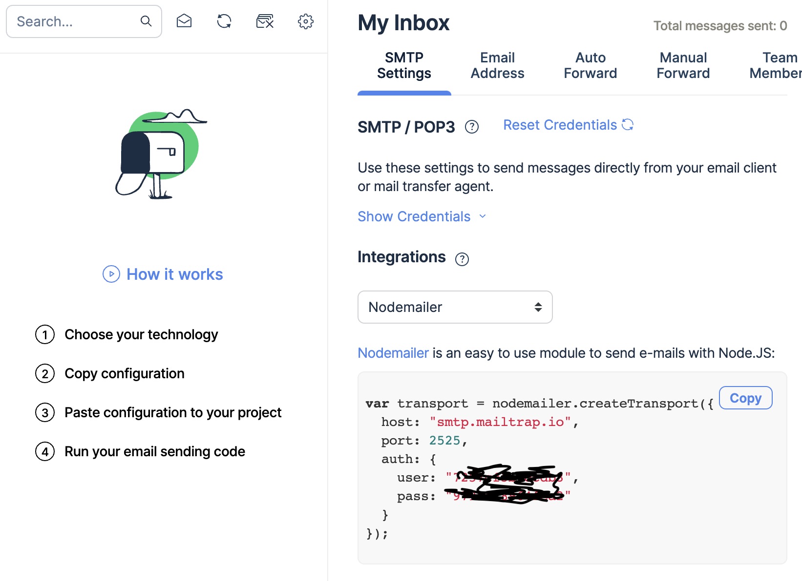

[Node](https://youtu.be/toLDNN4FQv0)

- 클라이언트와 서버가 다르다!
  -> 그렇기에 둘 다 알아아하는 어려움이 생길 수 있다!

- 개발 초심자에게는 이 부분이 큰 장벽으로 다가선다.

- Node.js는 javascript이다.(클라이언트 서버 프로그램이 두개로 가능해진다!)

- npm(node package manager) 등을 비롯한 생태계가 아주 잘 구성 되어 있다.

[설치 사이트](https://nodejs.org/ko/download/)
-> node, npm 확인 가능

- node "js 파일명"하면 실행가능!

---

## 이메일 만들어보기

### npm nodemailer

[nodemailer](https://nodemailer.com/about/)

```shell
npm install nodemailer
```

## 메일 서버 대행 서비스

[mailtrap.io](https://mailtrap.io)


```js
const nodemailer = require("nodemailer");
const email = {
  host: "smtp.mailtrap.io",
  port: 2525,
  auth: {
    user: "****",
    pass: "****",
  },
};
const send = async (option) => {
  nodemailer.createTransport(email).sendMail(option, (error, info) => {
    if (error) {
      console.log(error);
    } else {
      console.log(info);
      return info.response;
    }
  });
};

let emailData = {
  from: "moons@unist.ac.kr",
  to: "moons@unist.ac.kr",
  subject: "테스트 메일 입니다",
  text: "nodejs 한시간 가능할까?",
};
send(emailData);
```

```
{
  accepted: [ 'moons@unist.ac.kr' ],
  rejected: [],
  envelopeTime: 575,
  messageTime: 517,
  messageSize: 352,
  response: '250 2.0.0 Ok: queued',
  envelope: { from: 'moons@unist.ac.kr', to: [ 'moons@unist.ac.kr' ] },
  messageId: '<2f59c2eb-2441-1906-7e0c-71f9ad117315@unist.ac.kr>'
}
```

> 실제로 잘작동되고, mailtrap.io에서도 확인할수 있었다.

### 서버

```
npm install express --save
```

```js
const express = require("express");
const app = express();

const server = app.listen(3000, () => {
  console.log("Start Sever : localhost:3000");
});
```

> localhost:3000에서 잘 작동하는 것을 확인할 수 있다.

```js
const express = require("express");
const app = express();

const server = app.listen(3000, () => {
  console.log("Start Sever : localhost:3000");
});

app.set("views", __dirname + "/views");

app.set("view engine", "ejs");
app.engine("html", require("ejs").renderFile);

app.get("/", function (req, res) {
  res.render("index.html");
});

app.get("/about", function (req, res) {
  res.send("about page");
});
```

### 템플릿

[ejs](https://ejs.co/);

- index.html 파일의 경우에도 띄워주는 것을 볼수가 있다.

### mariaDB - mysql 기능 활용하기

```
npm install mysql --save
```

[mysql](https://www.npmjs.com/package/mysql)

```js
const express = require("express");
const app = express();

const server = app.listen(3000, () => {
  console.log("Start Sever : localhost:3000");
});

app.set("views", __dirname + "/views");

app.set("view engine", "ejs");
app.engine("html", require("ejs").renderFile);

app.get("/", function (req, res) {
  res.render("index.html");
});

app.get("/about", function (req, res) {
  res.send("about page");
});

var mysql = require("mysql");
var pool = mysql.createPool({
  connectionLimit: 10,
  host: "example.org",
  password: "secret",
  database: "my_db",
});

app.get("/db", function (res, req) {
  pool.getConnection(function (err, connection) {
    if (err) throw err; // not connected!
    // Use the connection
    connection.query("select * from Test", function (error, results, fields) {
      res.send(JSON.stringify(results));
      console.log("results", results);
      // When done with the connection, release it.
      connection.release();

      // Handle error after the release.
      if (error) throw error;

      // Don't use the connection here, it has been returned to the pool.
    });
  });
});
```

> 위처럼 mariadB 연결도 가능함

결론

1. 자바스크립트만 알면 클라이언트, 서버프로그래밍이 가능하다
2. NPM을 통해서 이미 잘 개발되어진 모듈을 빠르게 설치, 적용할 수 있다.
3.
