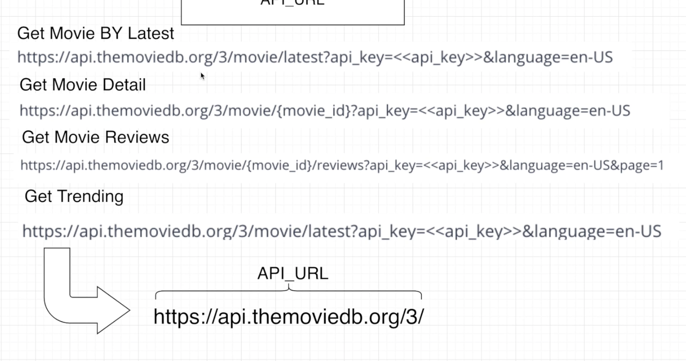
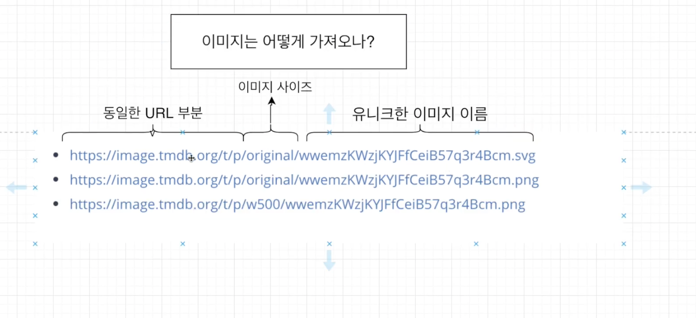

# 2. Boiler-Plate & MongoDB 연결(따라하며 배우는 리액트 노드)

1. Boiler-plate 이용 이유

- 더 빠르게 개발을 완성하기 위해서
- 프로젝트의 중요한 부분을 더욱 집중할 수 있기 위해서
- 이미 Boiler-plate를 위한 강의가 찍어져 있어서

2. Boiler Plate 다운로드
   [링크](https://github.com/jaewonhimae/boilerplate-mern-stack)
   -> 나는 여기서 git clone해서 복사하였음!!

3. boiler plate 실행

- 서버와 클라이언트에서 Dependencies 다운받기(루트에 받기, 여기서는 src) npm install (하나하나 해줄줄 알았는데 npm install로 한방에 해준다..ㅎㅎ)
- dev.js 파일 생성
- MongoDB 로그인
- 클러스터 만든 후 아이디 비번 생성후 dev.js 파일에 넣는다.

---

# 3. The MovieDB API

1. The MovieDB Website로 이동
   [ThemovieDB]](https://www.themoviedb.org)
2. 가입 후 로그인 & API_KEY 받기

- 회원가입 후 로그인하여
- 프로필 - 설정 - API - Request an API key - developer

3. Text Editor에서 the MovieDB API를 위한 설정





> 반복되는 부분을 고정하고 유동적으로 쓰도록 하자!!

---

# 4. Landing Page 만들기(1)

1. 전체적인 템플릿을 간단하게 만들기
2. Movie API에서 가져온 모든 데이터를 State에 넣기
3. MainImage Component를 만들기
4. Grid Card Component 만들기
5. Load More Function 만들기

[깃허브](https://github.com/jaewonhimnae/react-movie-app-ko/blob/master/client/src/components/views/LandingPage/LandingPage.js)

---

# 5. Grid 만들기

```js
<Row gutter={[16, 16]}>
  {Movies &&
    Movies.map((movie, index) => (
      <React.Fragment key={index}>
        <GridCards
          image={
            movie.poster_path
              ? `${IMAGE_BASE_URL}w500${movie.poster_path}`
              : null
          }
          movieId={movie.id}
          movieName={movie.original_title}
        />
      </React.Fragment>
    ))}
</Row>
```

```js
function GridCards(props) {
  return (
    <div>
      <Col lg={6} md={8} sm={12} xs={24}>
        <div style={{ position: "relative" }}>
          <a href={`/movie/${props.movieId}`}>
            
          </a>
        </div>
      </Col>
    </div>
  );
}
```

---

# 6. Load More Button 만들기

```js
const loadMoreItems = () => {
  const endpoint = `${API_URL}movie/popular?api_key=${API_KEY}&language=en-US&page=${
    CurrentPage + 1
  }`;
  fetchMovies(endpoint);
};

const fetchMovies = (endpoint) => {
  fetch(endpoint)
    .then((response) => response.json())
    .then((response) => {
      console.log(response);
      setMovies([...Movies, ...response.results]); //...Movies 해야 원래 것에 추가!
      setMainMovieImage(response.results[0]);
      setCurrentPage(response.page);
    });
};

<div style={{ display: "flex", justifyContent: "center" }}>
  <button onClick={loadMoreItems}>Load More</button>
</div>;
```

---

# 7. Movie Detail 페이지 만들기

1. 특정 영화에 해당하는 자세한 정보를 가져오기 (props.match.params.movieId)
2. 무비 API에서 가져온 정보를 State에다가 집어 넣기
3. 전체적인 Template 간단히 만들기
4. 영화에 나오는 crew information를 가져오기
5. 가져온 crew 정보를 state에 넣기
6. State에 보관된 data들을 화면에 보여주기

---

# 8. 영화 출연진들 가져오기

### moviedetail

```js
{
  ActorToggle && (
    <Row gutter={[16, 16]}>
      {Casts &&
        Casts.map((cast, index) => (
          <React.Fragment key={index}>
            <GridCards
              image={
                cast.profile_path
                  ? `${IMAGE_BASE_URL}w500${cast.profile_path}`
                  : null
              }
              characterName={cast.name}
            />
          </React.Fragment>
        ))}
    </Row>
  );
}
```

### Grid

```js
function GridCards(props) {
  if (props.landingPage) {
    return (
      <div>
        <Col lg={6} md={8} sm={12} xs={24}>
          <div style={{ position: "relative" }}>
            <a href={`/movie/${props.movieId}`}>
              
            </a>
          </div>
        </Col>
      </div>
    );
  } else {
    return (
      <div>
        <Col lg={6} md={8} xs={24}>
          <div style={{ position: "relative" }}>
            
          </div>
        </Col>
      </div>
    );
  }
}
```

---

# 9. Favorite Feature

1. Favorite Model 만들기
   - userFrom
   - movieId
   - movieTitle
   - movieImage
   - movieRunTime
2. Favorite Button UI 만들기
3. 얼마나 많은 사람이 이 영화를 Favorite 리스트에 넣었는지 그 숫자 정보 얻기
4. 내가 이 영화를 이미 Favorite 리스트에 넣었는지 아닌지 정보 얻기
5. 데이터를 화면에 보여주기

---

# 12. Favorite List에 추가 삭제

1. 특정 영화를 Favorite 리스트에 넣는 기능 만들기

- ADD TO FAVORITE 0

2. 특정영화를 Favorie 리스트에서 뺴는 기능 만들기

- Remove From Favorite 1

3. 아직 Favorite 리스트에 안 넣었을 때

- Add to Favorite List

4. 이미 리스트에 넣어져 있을 떄

- Remove From Favorite List!

---

# 13. Favorite Page 만들기

1. Favorite 페이지를 위한 템플릿을 간단히 만들기
2. MongoDB에서 Favorite으로 된 영화 정보들을 가져오기
3. 가져온 데이터들을 화면에서 보여주기
4. Remove 기능 만들기
