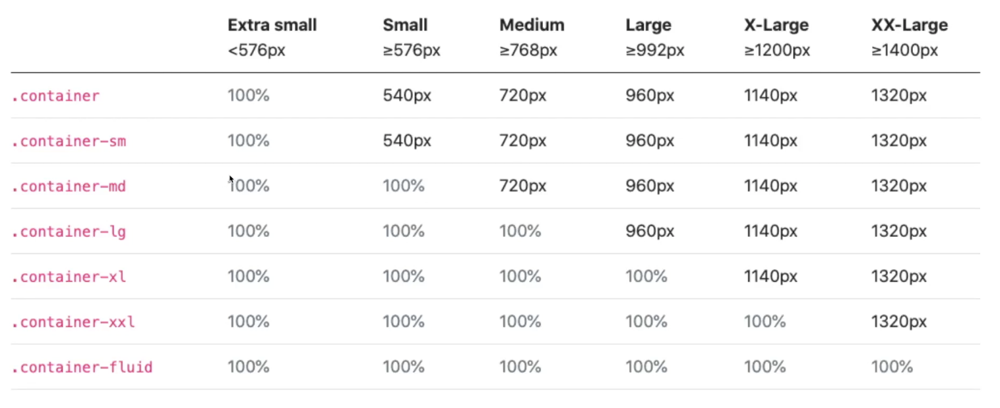
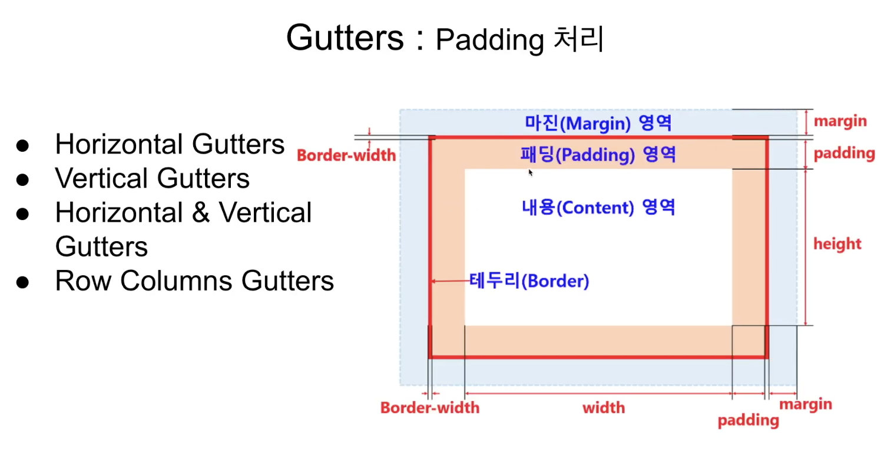
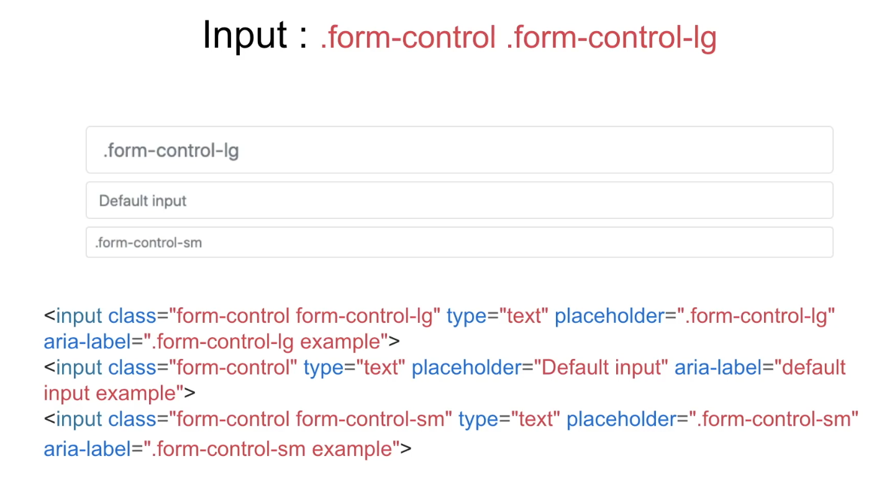
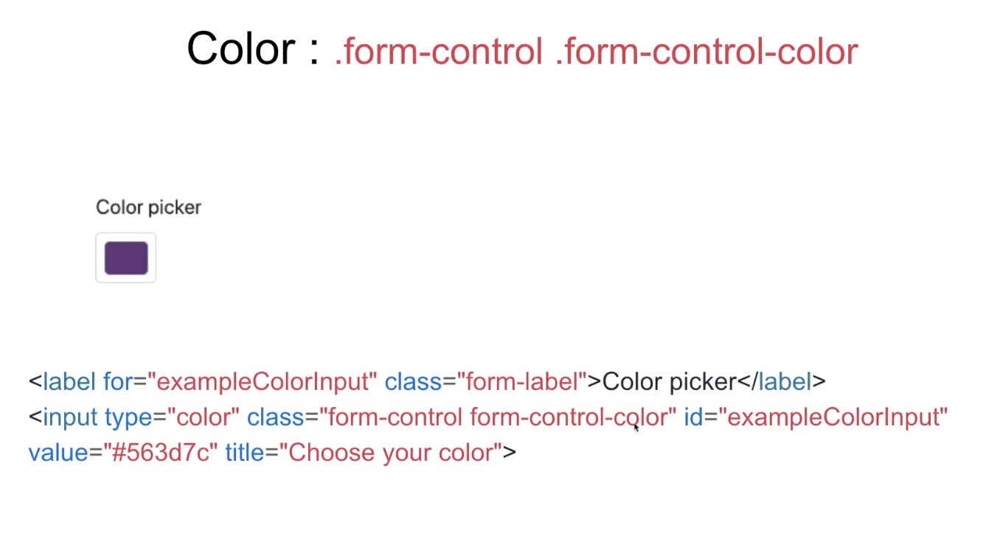
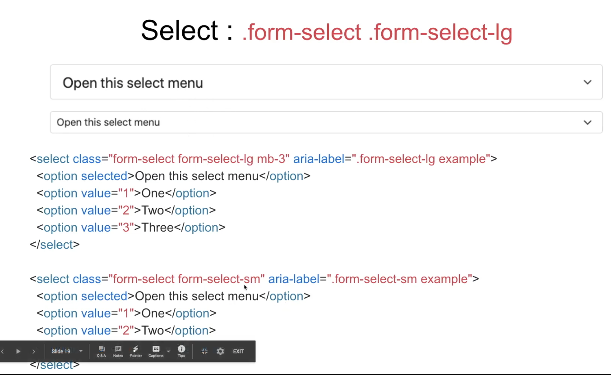
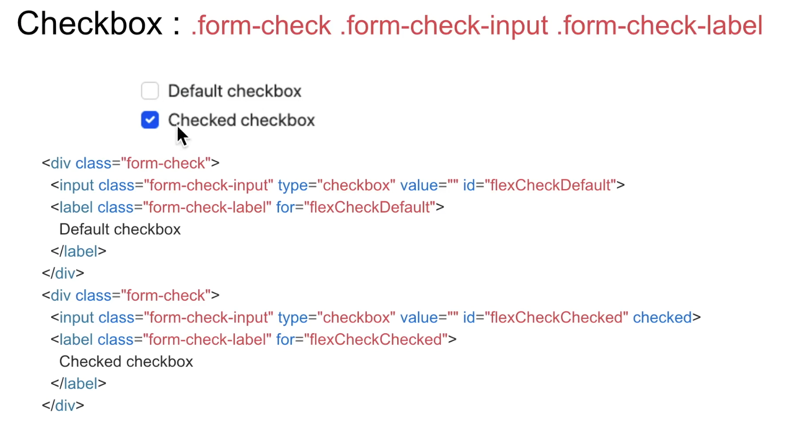
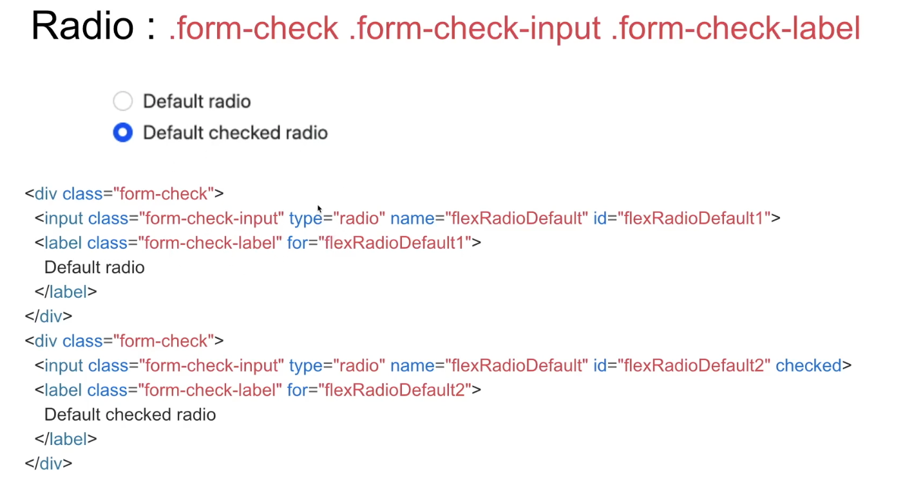
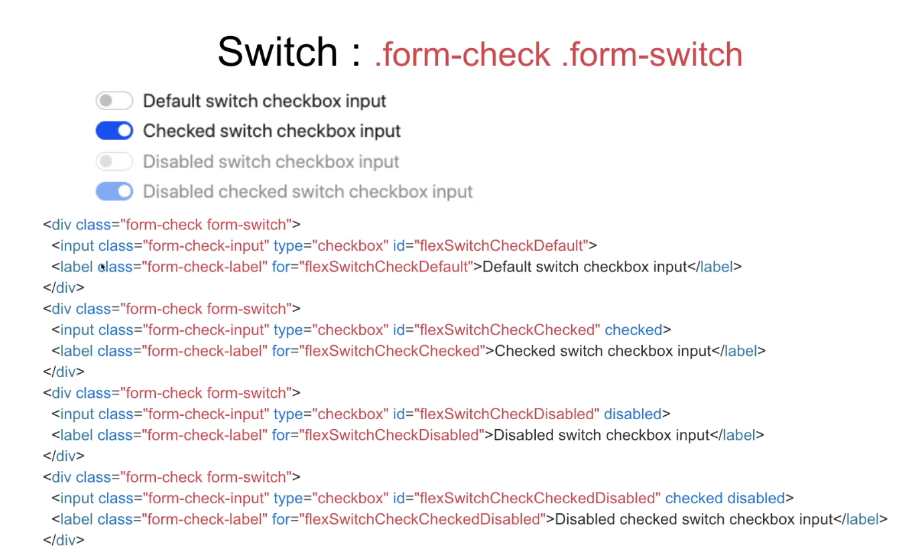
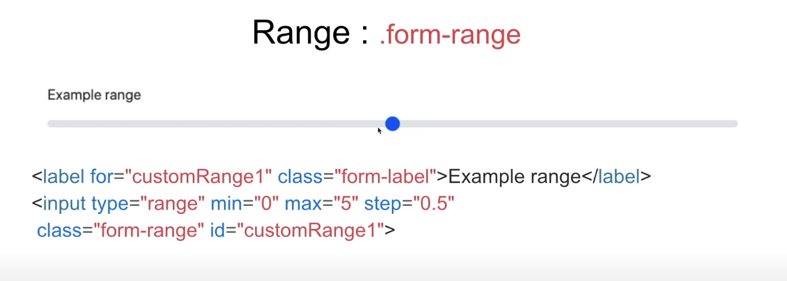
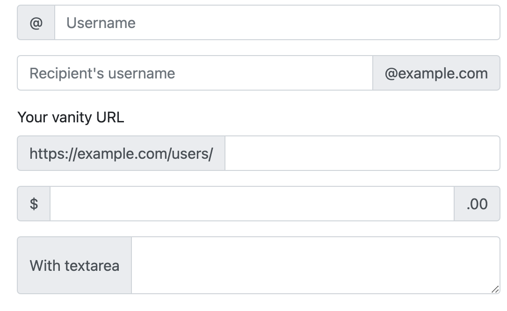

# 제품 판매 웹앱 구현

## 구성

1. 제품판매웹앱 - 전체 구현이 아닌 제품등록과 제품검색, 제품상세페이지까지만
2. 부트스트랩 기본 익히기
3. 제품 검색/리스트 페이지 html 만들어보기
4. 제품 상세 페이지 html 만들어보기
5. 제품 등록 페이지 html 만들어보기
6. MariaDB 설치하기
7. DB 테이블 설계하기
8. SQL 목록 및 구현하기
9. Node.js + Express 웹서버 만들기
10. DB 연동하기
11. Vue CLI 이용해서 클라이언트 만들기
12. 부트스트랩 테마 Vue로 구성하기
13. 제품 검색/ 리스트 컴포넌트 구현하기
14. 제품 상세 컴포넌트 구현하기
15. 제품 생성 컴포넌트 구현하기
16. 최종 리뷰

---

# 02. 부트스트랩 기본 익히기

- 부트스트랩은 다양한 크기의 사용자 디바이스에 최적의 웹 화면 UI를 구현할 수 있도록 제공되는 반응형 웹 프론트엔드 디자인 툴킷임.(HTML, CSS, JavaScript)

## 부트스트랩 구성

- Layout - 화면 레이아웃(구조)를 구성, 특히 반응형 웹을 처리
- Content - 타이포그래피, 이미지, 테이블 등
- Forms - 사용자 입력 처리와 관련되 이미지(input, select, checkbox, radio 등)
- Components - Forms를 제외한 화면 UI 요소
- Helpers - UI 요소에 대한 위치, 비율, 보이기/감추기 등
- Utilities - 보더, 색상, 사이즈, 정렬 등
- Extend - 아이콘

## Layout

- Breakpoints : 사용자의 디바이스 사이즈에 따라 레이아웃 변경 처리

|    Breakpoint     | Class infix | Dimensions |
| :---------------: | :---------: | :--------: |
|      X-Small      |    None     |   <576px   |
|       Small       |     sm      |  >=576px   |
|      Medium       |     md      |  >=768px   |
|       Large       |     lg      |  >=992px   |
|    Extra Large    |     xl      |  >=1200px  |
| Extra extra large |     xxl     |  >=1400px  |

## Container

: 컨텐츠를 담는 그릇에 해당하는 레이아웃 처리


[예시](cotainer.html)

## Grid

: 12 Grids 기준으로 해상도에 따른 레이아웃 처리

[예시](grid.html)
: 화면의 크기(해상도)에 따라서 보여주기 위해서 분할을 해서 정의 해놓았다.

- 부트스트랩에서는 12 grid를 적용하였다.
  [참고 링크](https://getbootstrap.com/docs/4.5/layout/grid/)

- 좌우 상하 정렬

```html
<div class="container">
  <div class="row align-items-start">
    <div class="col">One of three columns</div>
    <div class="col">One of three columns</div>
    <div class="col">One of three columns</div>
  </div>
  <div class="row align-items-center">
    <div class="col">One of three columns</div>
    <div class="col">One of three columns</div>
    <div class="col">One of three columns</div>
  </div>
  <div class="row align-items-end">
    <div class="col">One of three columns</div>
    <div class="col">One of three columns</div>
    <div class="col">One of three columns</div>
  </div>
</div>
```

- 순서 지정

```html
<div class="container">
  <div class="row">
    <div class="col">First in DOM, no order applied</div>
    <div class="col order-12">Second in DOM, with a larger order</div>
    <div class="col order-1">Third in DOM, with an order of 1</div>
  </div>
</div>
```

## Columns : 해상도에 따른 컬럼 높이, 순서, 정렬 처리

- Vertical Alignmnet
- Horizontal Alignment
- Column Wrapping
- Column Breaks
- Reordering
- Offsettgin Columns
- Margin Utilities

## Gutters (매우 중요)



---

# Contents

## Image : 이미지 정렬 및 사이즈 처리

- 반응형 이미지 처리 : width : 100%; height:auto;

```html

```

- 이미지 좌우 정렬

```html


 //항상 가운데
```

## Tables : 테이블 디자인

- 유용한 기능

```html
<table class="table table-striped">
  .table-borderd .table-hover .table-primary
</table>
```

- 일반적인 형태

```html
<table class="table">
  <thead>
    <tr>
      <th scope="col">#</th>
      <th scope="col">First</th>
      <th scope="col">Last</th>
      <th scope="col">Handle</th>
    </tr>
  </thead>
  <tbody>
    <tr>
      <th scope="row">1</th>
      <td>Mark</td>
      <td>Otto</td>
      <td>@mdo</td>
    </tr>
    <tr>
      <th scope="row">2</th>
      <td>Jacob</td>
      <td>Thornton</td>
      <td>@fat</td>
    </tr>
    <tr>
      <th scope="row">3</th>
      <td>Larry</td>
      <td>the Bird</td>
      <td>@twitter</td>
    </tr>
  </tbody>
</table>
```

---

# Form










- min, max, step 정할 수 있음

## Input Group



```html
<div class="input-group mb-3">
  <div class="input-group-prepend">
    <span class="input-group-text" id="basic-addon1">@</span>
  </div>
  <input
    type="text"
    class="form-control"
    placeholder="Username"
    aria-label="Username"
    aria-describedby="basic-addon1"
  />
</div>

<div class="input-group mb-3">
  <input
    type="text"
    class="form-control"
    placeholder="Recipient's username"
    aria-label="Recipient's username"
    aria-describedby="basic-addon2"
  />
  <div class="input-group-append">
    <span class="input-group-text" id="basic-addon2">@example.com</span>
  </div>
</div>

<label for="basic-url">Your vanity URL</label>
<div class="input-group mb-3">
  <div class="input-group-prepend">
    <span class="input-group-text" id="basic-addon3"
      >https://example.com/users/</span
    >
  </div>
  <input
    type="text"
    class="form-control"
    id="basic-url"
    aria-describedby="basic-addon3"
  />
</div>

<div class="input-group mb-3">
  <div class="input-group-prepend">
    <span class="input-group-text">$</span>
  </div>
  <input
    type="text"
    class="form-control"
    aria-label="Amount (to the nearest dollar)"
  />
  <div class="input-group-append">
    <span class="input-group-text">.00</span>
  </div>
</div>

<div class="input-group">
  <div class="input-group-prepend">
    <span class="input-group-text">With textarea</span>
  </div>
  <textarea class="form-control" aria-label="With textarea"></textarea>
</div>
```

> 상당히 유용해서 많이 쓰일 수 있다.

---

# Component

- 자주 쓰는 유형을 조합해서 만들어 놓았음.

[33분 45초](https://youtu.be/LjDouK_dI3o?t=2025)
