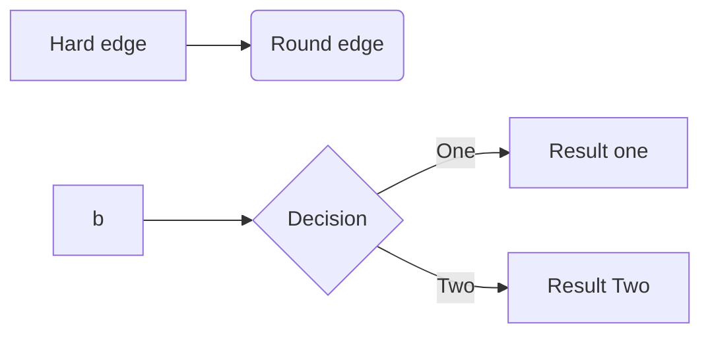
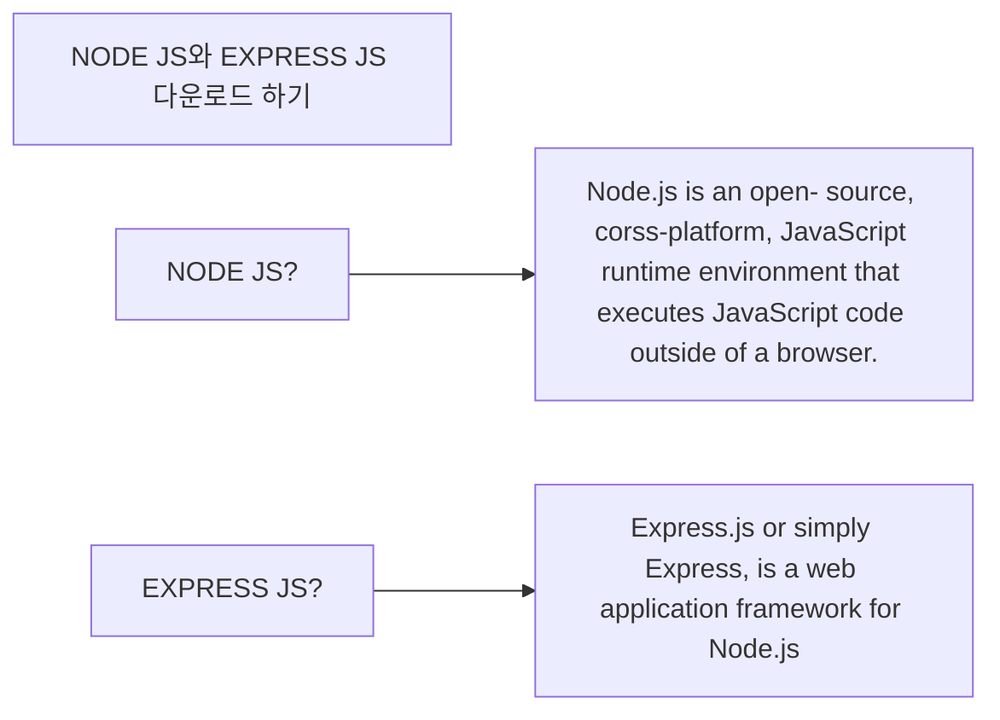
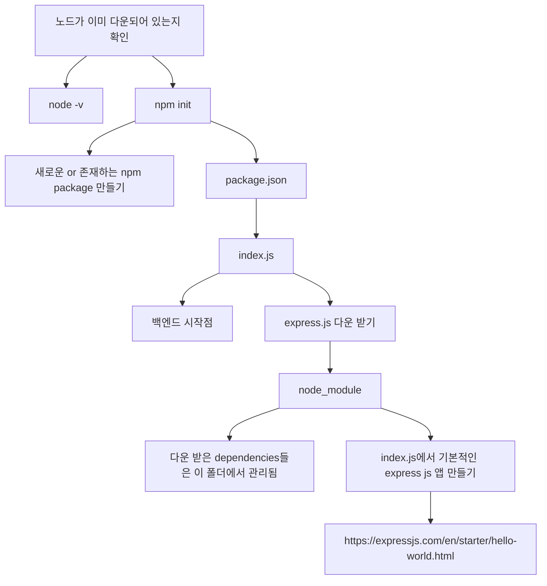
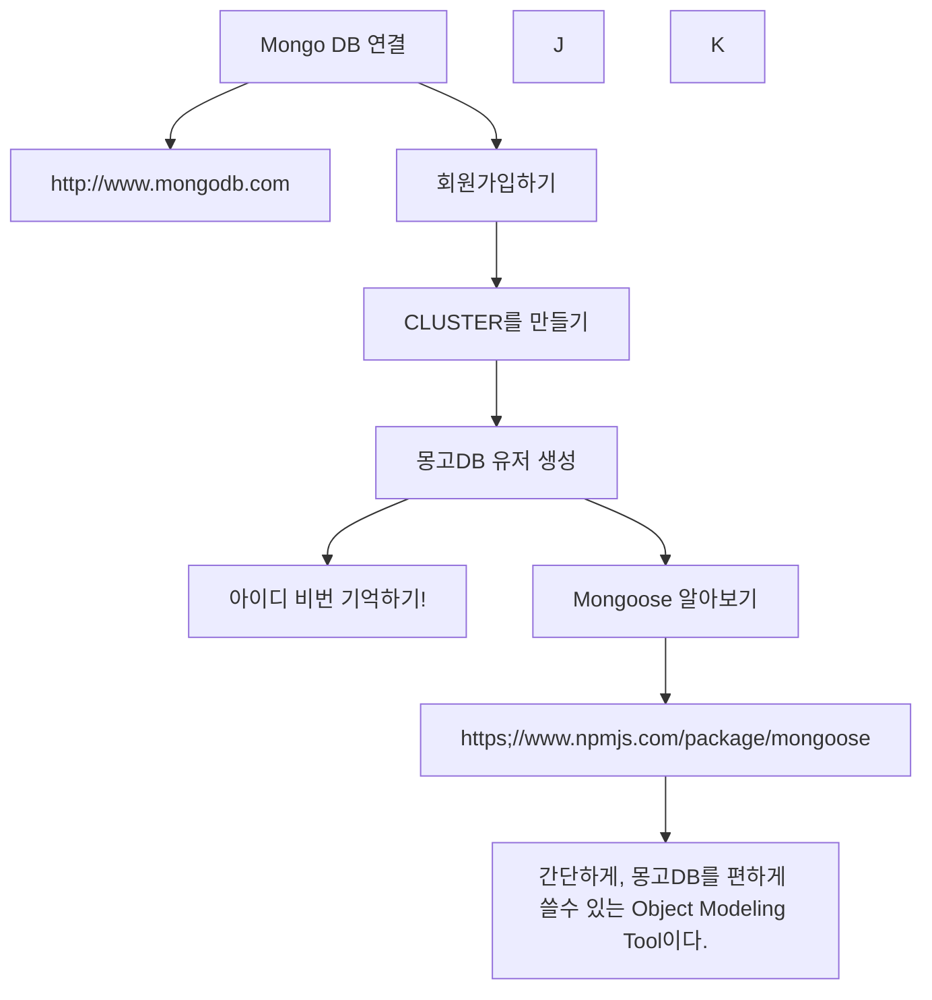

# Nodejs

---

Mermaid 참고
[참고 링크](https://richwind.co.kr/147)



---

# 2강 Node.js와 Express.js 다운로드 하기



> Node.js 자바스크립트를 서버사이드에서 쓸 수 있도록 도움 주는 것
> Nojde.js가 엔진이라면, Express는 기타 요소(애플리케이션, 웹)를 추가해주는 프레임워크



## 다운로드 받기

```
node -v
```

[nodejs](nodejs.org)
-> 가급적이면 LTS 추천

```
npm init
```

- 폴더에서 npm 패키지 다운로드 받기위해서 해당 명령어 필요함!

```shell
package name: (code)
version: (1.0.0)
description:
entry point: (index.js)
test command:
git repository:
keywords:
author:
license: (ISC)
About to write to /Users/Programming/00_Preparation/04_Nodejs/BoilerPlate/Code/package.json:

{
  "name": "code",
  "version": "1.0.0",
  "description": "",
  "main": "index.js",
  "scripts": {
    "test": "echo \"Error: no test specified\" && exit 1"
  },
  "author": "",
  "license": "ISC"
}
```

해당 정보를 설정할 수 있음!

### Express 다운로드 받기

```
npm install express --save
```

```json
  "dependencies": {
    "express": "^4.17.1"
  }
```

> JSON에서 추가된 것을 확인할 수 있음.

### Express 다운받기

```js
const express = require("express");
const app = express();
const port = 3000;

app.get("/", (req, res) => {
  res.send("Hello World!");
});

app.listen(port, () => {
  console.log(`Example app listening at http://localhost:${port}`);
});
```

### npm 시작하기

```shell
npm run start
```

> "Example app listening at http://localhost:3000" 와 같이 나타나는 것을 확인할 수 있다.

> 해당 사이트 들어가게 되면 "Hello World"보여지는 것도 확인할 수 있음.

---

# 3강 Mongo DB 연결하기



### MongoDB 다운로드하기

> 이 강의에서는 안나왔는데, Organization 만들고, Project 만들어야 Cluster를 만들수가 있는 것 같다!

1. Build a Cluser
2. Freetier 선택
3. AWS 선택하고 그나마 가까운 Singapore 선택하고, M0 Sandbox 선택!
4. 이름 정하기
   그리고 build

5~7분 정도 걸린다.

### MongoDB 유저 생성

- 클러스터에서 connect 누르고 원하는 User / pw 정하면 됨!
- 쭉 진행하다가 connection application 누르고
- 나타난 코드 복사하기!

### Mongoose

- 몽고DB를 편하게 쓸수 있는 툴

```
npm install mongoose --save
```

### 커텍션 에러의 경우

> MongoDB 클러스터와의 연결이 안되서 찾아봤습니다. 이 강의를 보시는분중에서 "MognDB Connected..!" 에서 에러가 나시는분은 참고해보세요.MongoDB Atlas에서 Network Access에 들어가시면 IP Address가 하나가 할당되어있습니다만, 제 IP Address와 다른 IP로 할당되어 있더라구요.(저는 외부에서 작업해서 그런것일수도..)우측의 초록색 ADD IP ADDRESS를 누르신 후, include your current IP address로 할당하시면 해결됩니다.처음에는 OS X기준 시스템 환경설정에서 네트워크의 IPv4 IP로 할당해도 안되어서 고민했는데, Atlas의 current IP address로 자체할당 하니 되더군요.
