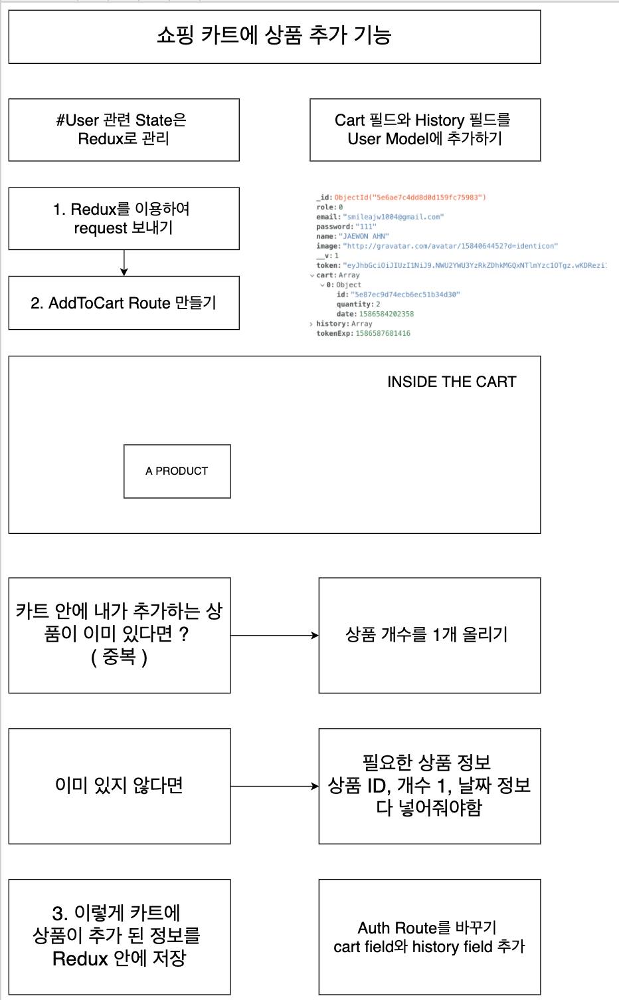
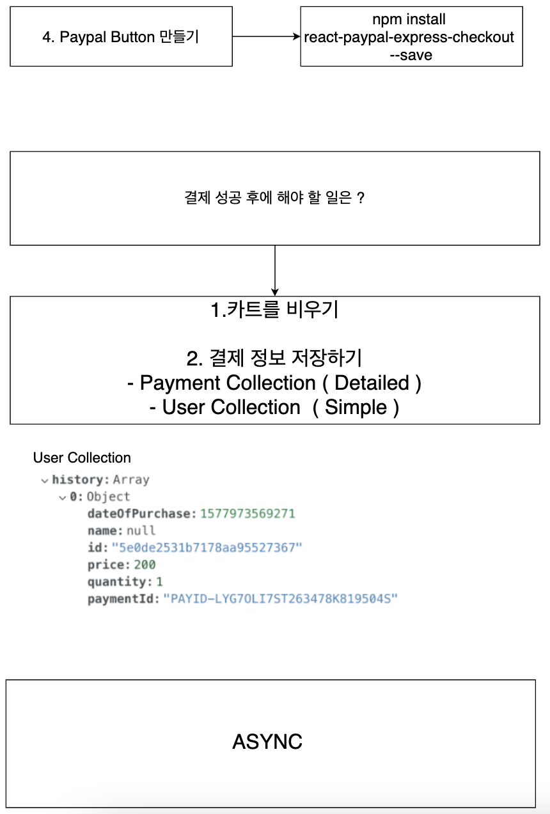

Hello, My Friends  
Thank you for having interest in this repository !

To use this application,

1. make dev.js file inside config folder
2. put mongoDB info into dev.js file
3. Type " npm install " inside the root directory ( Download Server Dependencies )
4. Type " npm install " inside the client directory ( Download Front-end Dependencies )

If you have problem, feel free to ask me ^^

You can watch the tutorial for this app.

https://www.youtube.com/channel/UCFyXA9x8lpL3EYWeYhj4C4Q?view_as=subscriber


---

# 3. 상품 업로드 페이지 만들기

1. 비어이는 업로드 페이지 생성
2. 업로드 페이지 Route 만들기
3. 업로드 페이지 탭 만들기
4. Drop zone을 제외한 Form을 만들기

- 파일 업로드만을 위한 컴포넌트 만들기

5. 모든 INPUT을 위한 onChange Function 만들기

---


# 6. Drop-zone 적용하기

1. Utils 폴더 안에 파일 업로드 파일 만들기
2. Drop-zone 라이브러리 다운받기

```shell
npm install react-dropzone --save
```

(클라이언트에서)

3. File 업로드 컴포넌트를 위한 UI 만들기

4. onDrop Function 만들기
   Multer

```shell
npm install multer --save
```

> Frontend와 Backend 간의 파일 전달을 위해서는 multer가 필요함

- 1. 파일 전달
- 2. 파일 저장 (multer 필요)
- 3. 파일 저장 정보 전달

5. onDelete Function 만들기

# 7. 이미지 파일을 서버로 보내기


# 8. multer를 이용하여 이미지 저장

### product.js

```js
const express = require("express");
const router = express.Router();
const multer = require("multer");
//=================================
//             Product
//=================================

var storage = multer.diskStorage({
  destination: function (req, file, cb) {
    cb(null, "uploads/");
  },
  filename: function (req, file, cb) {
    cb(null, `${Date.now()}_${file.originalName}`);
  },
});

var upload = multer({ storage: storage }).single("file");

router.post("/image", (req, res) => {
  // 가져온 이미지를 저장을 해주면 됨.
  upload(req, res, (err) => {
    if (err) {
      return req.json({ success: false, err });
    }
    return res.json({
      success: true,
      filePath: res.req.file.path,
      fileName: res.req.file.filename,
    });
  });
});
module.exports = router;
```

### 업로드한 파일 보여주기

```js
<div
  style={{
    display: "flex",
    width: "350px",
    height: "240px",
    overflowX: "scroll",
  }}
>
  {Images.map((image, index) => (
    <div key={index}>
      
    </div>
  ))}
</div>
```

# 9. 이미지 지우기

### 목적

- 사진을 클릭하였을 경우 지워지게 되어있다.

```js
const deleteHandler = (image) => {
  const currentIndex = Images.indexOf(image);
  let newImages = [...Images];
  newImages.splice(currentIndex, 1); //삭제하는 기능!
  setImages(newImages);
};

<div onClick={() => deleteHandler(image)} key={index}>
  
</div>;
```

# 10. 이미지 State를 부모 컴포넌트로 업데이트하기

> 파일을 업로드 하여야 하는데, 사진정보가 FileUplaod.js에만 있고 FileUploadPage.js에는 없게 된다.그래서 이 파일을 어떻게 정보를 부모 컴포넌트로 업데이트하는지 알아보아야 한다.

#### FileUploadPage

```js
const updateImages = (newImages) => {
  setImages(newImages);
};

<FileUpload refreshFunction={updateImages} />;
```

#### FileUpload

```js
props.refreshFunction([...Images, response.data.filePath]);
props.refreshFunction(newImages);
```

사진을 삭제하거나 올리면서 변경되는 Images 정보를 부모 컴포넌트와 실제 컴포넌트와 연동을 실시할 수 있었다.


# 11. 모든 상품 정보를 데이터베이스에 저장하기

> 사실상 가장 중요함!

Submit 버튼을 누르게 되면 서버를 통해서 DB에 저장하는 프로세스를 구축해야함!

---

# 랜딩 페이지 만들기

# 1. 데이터 베이스에 들어 있는 모든 상품을 가져오기








# 2. 카드 만들기

# 3. 이미지 슬라이더 만들기

# 4-5. 더보기 버튼 만들기

# 6-8. 체크 박스 필터 만들기

# 9-10. 라디어 박스 필터 만들기

# 11-12. 검색 기능 만들기

---

# 상세 보기 페이지 만들기

# 1. 상품의 상세 정보를 데이터베이스에서 가졍괴

# 2. Product Image 컴포넌트 만들기

# 3. Product Info 컴포넌트 만드릭

# 4-5. ADD TO CART버튼 만들기

---

# 카트 페이지 만들기

# 1. ADD TO CART 기능 개선 및 카트 Tab 만들기

# 2-3. 카트에 담긴 상품 정보들을 데이터베이스에서 가져오기

# 4. 데이터 베이스에서 가져온 상품 정보들을 화면에서 보여주기

# 5. 카트에 담긴 상품 정보 가져오는 부분 코드 수정

# 6. 카트에 들어있는 상품들 가격 계산

# 7. 카트에 들이있는 상품 지우기

# 8. 카트에 있는 모든 상품 지운 다음 처리할 것들

# 9. Paypal 버튼 만들기

# 10. Paypal로 결제하기

# 11-13. Paypal로 결제 성공 후 할 일 들

---

# 결제 내역 페이지 만들기

# 1. 결제 내역 페이지 만들기
